<div align="center">

<picture>
  <source media="(prefers-color-scheme: dark)" srcset="./banner.svg?v=1">
  <source media="(prefers-color-scheme: light)" srcset="./banner-light.svg?v=1">
  
</picture>

</div>

<br>

<!-- SPLIT INTRODUCTION PROFILE GRID -->
<table border="0" cellpadding="10" cellspacing="0" width="100%">
  <tr>
    <!-- Left Column: Virtual ID Card & Lanyard -->
    <td width="30%" align="center" valign="top">
      
      <br><br>
      <p>
        
      </p>
    </td>
    <!-- Right Column: Personal Bio & Social Links -->
    <td width="70%" valign="top">
      <h1>💫 About Me</h1>
      I am a performance-driven <strong>Full Stack Developer</strong> focused on designing and building impactful, user-centric digital products. Currently pursuing my <strong>B.Tech in Electronics & Telecommunication Engineering</strong>, I bridge academic rigor with real-world, hands-on software architecture.
      <br><br>
      
```typescript
const Pranav = {
  location: "Jalgaon, Maharashtra, India 📍",
  education: "B.Tech E&TC (Final Year) 🎓",
  role: "Full Stack Developer 💻",
  techStack: ["MERN Stack", "TypeScript", "System Design", "Redis", "Docker"],
  passion: "Building scalable, user-centric technological solutions 🚀",
  hackathonLead: "Status_404 — Godavari Hackathon 1.0 Finalist 🏆",
  availability: "Open to opportunities & collaborations 🌟",
};
```

#### 🛠️ What I Bring to Your Team:
- **The Full-Stack Mindset:** Adept at building robust frontend layers and connecting them seamlessly to secure, fast backend databases & APIs.
- **Strong Problem Solving:** A rigorous foundation in data structures, algorithms, and system architecture.
- **Leadership & Execution:** Experienced hackathon team lead dedicated to turning complex ideas into production-ready products.

<br>

<!-- Social Connection Links -->
<p align="left">
  <a href="https://github.com/PranavThorat1432" target="_blank">
    
  </a>
  <a href="https://www.linkedin.com/in/curiouspranavthorat/" target="_blank">
    
  </a>
  <a href="mailto:pranavthorat95@gmail.com" target="_blank">
    
  </a>
</p>
    </td>
  </tr>
</table>

<br>


<br>

<!-- CURRENT FOCUS SECTION -->
<h2 align="center">
  
  &nbsp;Current Focus
</h2>

<div align="center">
  <table width="100%">
    <tr>
      <td width="33%" align="center" valign="top">
        <br/><br/>
        <strong>Full-Stack Products</strong><br/>
        <sub>Web platforms from interface to API.</sub>
      </td>
      <td width="33%" align="center" valign="top">
        <br/><br/>
        <strong>Agentic AI</strong><br/>
        <sub>Intelligence embedded into workflows.</sub>
      </td>
      <td width="33%" align="center" valign="top">
        <br/><br/>
        <strong>Clean Architecture</strong><br/>
        <sub>Systems designed to scale with the product.</sub>
      </td>
    </tr>
  </table>
</div>

<br>

<!-- TECH STACK & TOOLS -->
<h2 align="center">🛠️ Tech Stack & Skills</h2>

<div align="center">

| Category | Technologies |
| :--- | :--- |
| **Languages** |       |
| **Frontend** |    |
| **Backend & DB** |      |
| **DevOps & Tools** |      |

</div>

<br>

<!-- FEATURED PROJECTS SHOWCASE -->
<h2>🚀 Featured Projects</h2>
<p><i>Here are some of my top open-source & production projects highlighting full-stack engineering, AI integration, and hardware automation:</i></p>

<br>

<!-- Project 1: GenWeb.ai -->
<table border="0" cellpadding="10" cellspacing="0" width="100%">
  <tr bgcolor="#161b22">
    <td width="70%" valign="top">
      <h3>✨ 01. GenWeb.ai — AI Website Generator</h3>
      <p><strong>Category:</strong> <code>SaaS</code> · <code>Agentic AI</code> · <code>Full-Stack</code></p>
      <p>An enterprise-grade SaaS Platform for AI-Driven Web Application Generation, featuring real-time Monaco code editing, instant cloud deployment, and automated credit token economics.</p>
      <ul>
        <li>⚡ <strong>Real-Time Code Editor:</strong> Live Monaco editor integration with hot preview capabilities.</li>
        <li>🤖 <strong>AI Orchestration:</strong> Multi-file project scaffolding via OpenRouter & LLMs.</li>
        <li>💳 <strong>SaaS Tokenomics:</strong> Complete credit subscription system powered by Stripe webhooks.</li>
      </ul>
    </td>
    <td width="30%" valign="top" align="center">
      <br>
      <a href="https://github.com/PranavThorat1432" target="_blank">
        
      </a>
      <br><br>
      <a href="https://github.com/PranavThorat1432" target="_blank">
        
      </a>
      <br><br>
      
    </td>
  </tr>
  <tr bgcolor="#0d1117">
    <td colspan="2">
      <strong>Tech Stack:</strong> &nbsp;
      
      
      
      
      
      
    </td>
  </tr>
</table>

<br>

<!-- Project 2: AI Powered YouTube Clone -->
<table border="0" cellpadding="10" cellspacing="0" width="100%">
  <tr bgcolor="#161b22">
    <td width="70%" valign="top">
      <h3>📺 02. AI Powered YouTube Clone</h3>
      <p><strong>Category:</strong> <code>Streaming</code> · <code>AI Search</code> · <code>MERN</code></p>
      <p>A comprehensive video streaming web application featuring AI-powered video search, real-time user interactions, and end-to-end media management.</p>
      <ul>
        <li>🔍 <strong>Semantic AI Search:</strong> Smart video search & recommendation algorithms.</li>
        <li>💬 <strong>Interactive Feeds:</strong> Live comments, likes, subscriber feeds, and watch history.</li>
        <li>🔐 <strong>Cloud Infrastructure:</strong> Firebase auth, media pipeline, and Nodemailer integration.</li>
      </ul>
    </td>
    <td width="30%" valign="top" align="center">
      <br>
      <a href="https://github.com/PranavThorat1432" target="_blank">
        
      </a>
      <br><br>
      <a href="https://github.com/PranavThorat1432" target="_blank">
        
      </a>
      <br><br>
      
    </td>
  </tr>
  <tr bgcolor="#0d1117">
    <td colspan="2">
      <strong>Tech Stack:</strong> &nbsp;
      
      
      
      
      
      
    </td>
  </tr>
</table>

<br>

<!-- Project 3: MedRouteV2 -->
<table border="0" cellpadding="10" cellspacing="0" width="100%">
  <tr bgcolor="#161b22">
    <td width="70%" valign="top">
      <h3>🏥 03. MedRouteV2 — Emergency Bed & Navigation Platform</h3>
      <p><strong>Category:</strong> <code>Healthcare</code> · <code>GIS / Maps</code> · <code>Hackathon Finalist</code></p>
      <p>Real-time hospital bed availability and emergency navigation platform engineered for <strong>Godavari Hackathon 1.0 (Finalist — Team Status_404)</strong>.</p>
      <ul>
        <li>🗺️ <strong>Live Mapping:</strong> Leaflet.js interactive map with live hospital markers & bed status.</li>
        <li>🌐 <strong>Trilingual UI:</strong> Multi-language UI for immediate accessibility during medical emergencies.</li>
        <li>🔒 <strong>Admin Portal:</strong> JWT-secured portal for hospital bed inventory updates.</li>
      </ul>
    </td>
    <td width="30%" valign="top" align="center">
      <br>
      <a href="https://github.com/PranavThorat1432" target="_blank">
        
      </a>
      <br><br>
      <a href="https://github.com/PranavThorat1432" target="_blank">
        
      </a>
      <br><br>
      
    </td>
  </tr>
  <tr bgcolor="#0d1117">
    <td colspan="2">
      <strong>Tech Stack:</strong> &nbsp;
      
      
      
      
      
      
    </td>
  </tr>
</table>

<br>

<!-- Project 4: Vybe -->
<table border="0" cellpadding="10" cellspacing="0" width="100%">
  <tr bgcolor="#161b22">
    <td width="70%" valign="top">
      <h3>⚡ 04. Vybe — Next-Gen Social Media</h3>
      <p><strong>Category:</strong> <code>Social Platform</code> · <code>Real-Time WebSockets</code> · <code>MERN</code></p>
      <p>A modern social media ecosystem engineered for real-time interaction, storytelling, and community-driven content feeds.</p>
      <ul>
        <li>💬 <strong>Instant Communication:</strong> Socket.io powered instant chat, notifications, and live status.</li>
        <li>📸 <strong>Media Pipeline:</strong> Cloudinary integration for fast image upload and transformation.</li>
        <li>🚀 <strong>Scalable Backend:</strong> Clean modular Node/Express architecture with optimized database querying.</li>
      </ul>
    </td>
    <td width="30%" valign="top" align="center">
      <br>
      <a href="https://github.com/PranavThorat1432" target="_blank">
        
      </a>
      <br><br>
      <a href="https://github.com/PranavThorat1432" target="_blank">
        
      </a>
      <br><br>
      
    </td>
  </tr>
  <tr bgcolor="#0d1117">
    <td colspan="2">
      <strong>Tech Stack:</strong> &nbsp;
      
      
      
      
      
      
    </td>
  </tr>
</table>

<br>

<!-- Project 5: Smart Parking System -->
<table border="0" cellpadding="10" cellspacing="0" width="100%">
  <tr bgcolor="#161b22">
    <td width="70%" valign="top">
      <h3>🅿️ 05. Smart Parking Automation System</h3>
      <p><strong>Category:</strong> <code>IoT / Embedded</code> · <code>Automation</code> · <code>C++ / Hardware</code></p>
      <p>Hardware-software IoT automation system with toggleable RFID authentication, averaged ultrasonic distance sensing, and automated servo gate barrier control.</p>
      <ul>
        <li>🏷️ <strong>RFID Barrier Security:</strong> Toggleable RFID badge verification for authorized vehicle entry.</li>
        <li>📡 <strong>Precision Sensing:</strong> Averaged ultrasonic distance measurement for real-time slot detection.</li>
        <li>⚙️ <strong>Microcontroller Integration:</strong> Arduino C++ program controlling servo motors & I2C LCD screen.</li>
      </ul>
    </td>
    <td width="30%" valign="top" align="center">
      <br>
      <a href="https://github.com/PranavThorat1432" target="_blank">
        
      </a>
      <br><br>
      <a href="https://github.com/PranavThorat1432" target="_blank">
        
      </a>
      <br><br>
      
    </td>
  </tr>
  <tr bgcolor="#0d1117">
    <td colspan="2">
      <strong>Tech Stack:</strong> &nbsp;
      
      
      
      
      
    </td>
  </tr>
</table>

<br>

<!-- GITHUB STATS & ANALYTICS -->
<h2>📊 GitHub Stats</h2>

<div align="center">
  
  
  
</div>

<br>

<!-- GITHUB TROPHIES -->
<h2>🏆 GitHub Trophies</h2>

<p align="center">
  
</p>

<br>

<!-- CONTRIBUTION ACTIVITY -->
<h2>🔥 Contribution Activity</h2>

<div align="center">

</div>

<br>

<!-- CONNECT WITH ME -->
<h2 align="center">📫 Connect With Me</h2>

<div align="center">

<a href="mailto:pranavthorat95@gmail.com">
  
</a>
<a href="https://github.com/PranavThorat1432">
  
</a>
<a href="https://www.linkedin.com/in/curiouspranavthorat/">
  
</a>

<br><br>


</div>

<br>

<!-- SNAKE ANIMATION -->
<div align="center">

<picture>
  <source media="(prefers-color-scheme: dark)" srcset="https://raw.githubusercontent.com/PranavThorat1432/PranavThorat1432/output/github-snake-dark.svg?v=1">
  <source media="(prefers-color-scheme: light)" srcset="https://raw.githubusercontent.com/PranavThorat1432/PranavThorat1432/output/github-snake-light.svg?v=1">
  
</picture>

</div>

<br><br>

<!-- FUN FACT & QUOTE -->
<h2>💡 Fun Fact</h2>

> I believe in learning by building — every project I create is a step forward.  
> *"Code. Break. Fix. Learn. Repeat."*

---

### 💬 Quote of the Day

<p align="center">
  
</p>

<br/>

<div align="center">
<sub>Built by Pranav Thorat — hand-built local SVGs (banner, lanyard, stats, languages, trophies).</sub>


</div>
